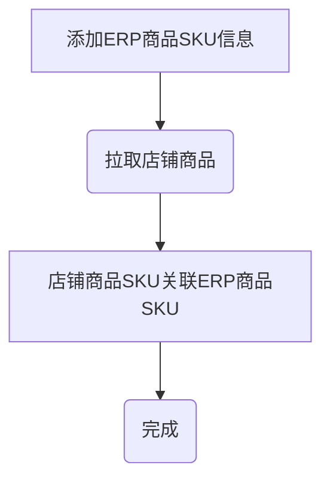
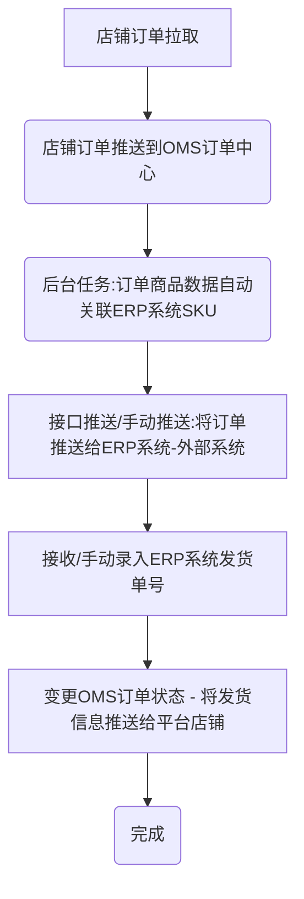
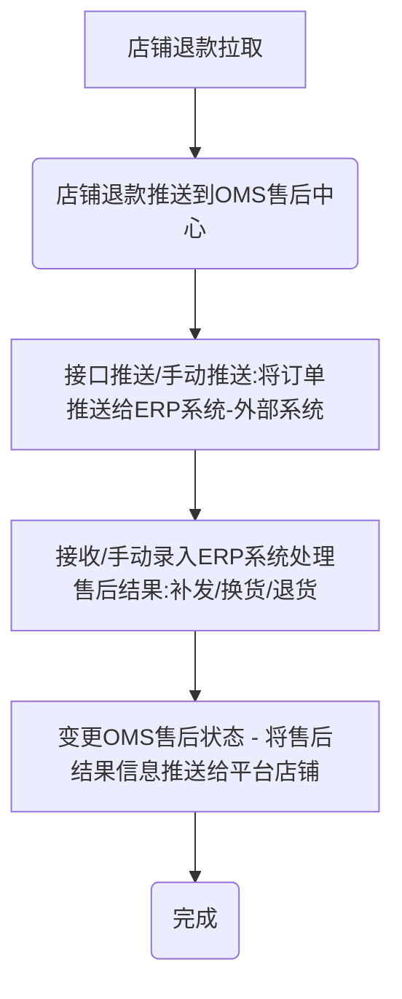

# 启航电商ERP即时零售系统


启航电商ERP即时零售系统支持抖店来客、美团闪购等，

**参与测试请联系作者qihangec168**

## 一、系统介绍

启航电商ERP即时零售系统是集订单处理、即时配送履约、仓库管理等全流程即时零售电商业务系统。支持多平台多店铺，包括抖店来客、美团闪购等。

主体功能包括：订单管理（订单拉取、处理）、配送履约管理、售后管理（补发、换货、退货处理）、商品管理、店铺管理等。

采用SpringCloud微服务架构开发，后续将开放接口对接其他系统。


## 二、关键流程

### 2.1 关联商品SKU



### 2.2 处理订单（发货）



### 2.3 处理售后




## 三、软件架构
### 1、开发环境级组件
#### 1.1 开发环境
+ Jdk：17
+ Nodejs：v16.20.0

#### 1.2 项目组件
##### 后端核心组件
+ SpringBoot：3.0.2
  + spring-boot-starter-security
+ SpringCloud：2022.0.0
  + SpringCloud Gateway
  + Eureka
+ MySQL8
+ Redis：7.x


##### 前端框架及组件
+ vue2
+ element


### 2、项目结构
#### 2.1 core
项目公共模块包括：

+ `common`:公共类型

+ `security`:公共权限验证模块

#### 2.2 eureka-server

**微服务注册中心**

#### 2.3 gateway

网关项目，负责微服务接口转发，前端统一通过网关调用其他微服务接口；

采用`gateway`进行api分发，引入Sentinel进行流量治理。

#### 2.4 业务微服务
##### auth-api
系统类微服务，主要功能包括：

+ 用户
+ 菜单

##### oms-api
oms主功能微服务，主要功能包括：

+ 队列消息处理（订单消息、退款消息）
+ 订单接口
+ 退款接口
+ 店铺接口

##### open-api
各开放平台微服务
##### tms-api
tms模块微服务

##### offline-api
手动添加订单模块


### 3、运行说明
#### 3.1、启动环境

1. 启动MySQL8
2. 启动Redis7

#### 3.2、导入数据库
+ 创建数据库`qihang-erp`
  + 导入数据库结构：sql脚本`docs\qihangerp-cbce.sql`

#### 3.3、启动服务(项目)
1.  启动微服务注册中心EurekaServer
2.  启动gateway网关
3.  启动业务微服务（auth-api、oms-api、tms-api）

#### 3.4、运行前端
+ Nodejs版本：v16.20.0
+ 进入`vue`文件夹
+ 运行`npm install` 
+ 运行`npm run dev`
+ 浏览网页`http://localhost`

### 4、项目部署

#### 4.1 打包

##### 后端打包
`mvn clean package`

##### 前端打包
`pnpm run build:prod`


#### 4.2 Nginx配置
```
# 上传文件至远程服务器
将打包生成在 `dist` 目录下的文件拷贝至 `/usr/share/nginx/html` 目录

# nginx.cofig 配置
server {
	listen     80;
	server_name  localhost;
	location / {
			root /usr/share/nginx/html;
			index index.html index.htm;
	}
	# 反向代理配置
	location /prod-api/ {
			proxy_pass http://127.0.0.1:8080/; # 替换成你的后端网关API地址
	}
}
```

## 四、一起交流

**感谢大家的关注与支持！希望利用本人从事电商10余年的经验帮助到大家提升工作效率！**

💖 如果觉得有用记得点 Star⭐


💖 欢迎一起交流！


